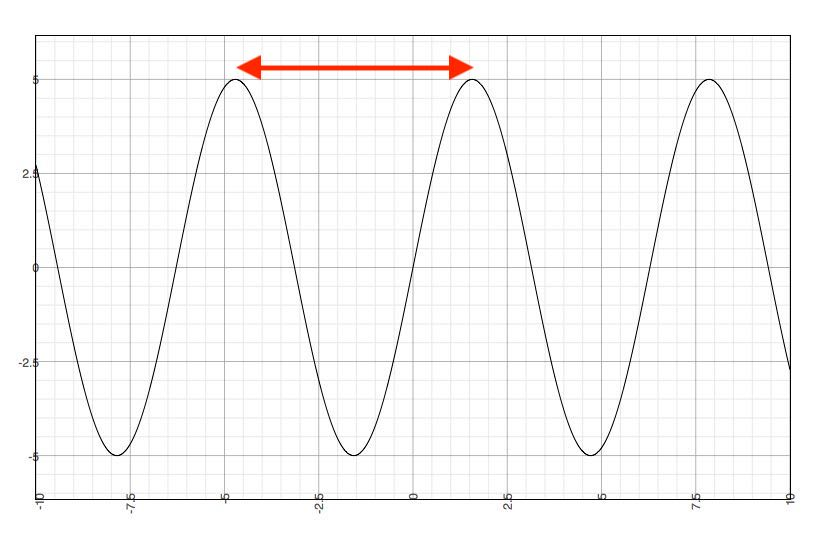
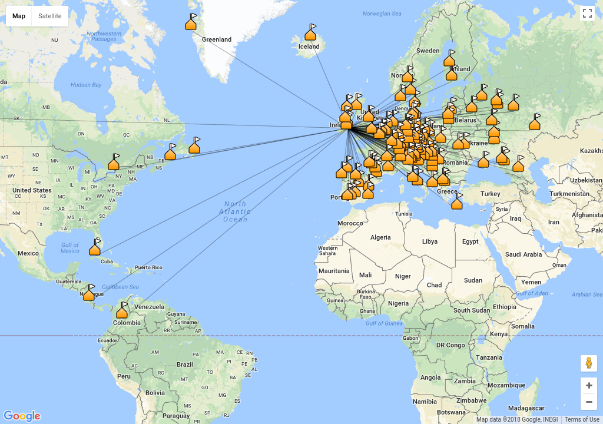

## Introduction to Ham Radio

* Martin Murphy - EI2HIB

<!--s-->

## Overview

* Ham Radio
* What is Radio?
* Regulations
* Organisations
* Areas of Interest

Note: This is a brief overview of Amateur Radio - a little bit about radio itself and the fact that it's regulated, but mostly about the various different areas of interest.

<!--s-->

## Ham Radio

* Also known as Amateur Radio
  * non-commercial
  * non-encrypted
* Since the invention of radio
* Must pass an exam
  * Harmonised Amateur Radio Examination Certificate
* Need a licence - ComReg

Note: Amateur Radio has been in existence since the invention of radio.  Also called Ham Radio. Only available for experimentation, communications and self training. There is an exam covering radio, electronics, and regulations.  Once you get a licence you get a call signm e.g. EI2HIB, E[IJ]* == Ireland, F* == France

<!--s-->

## What is Radio?

* Electro-Magnetic Radation
* Line-of-sight
  * Repeaters
  * HF - Ionosphere
* Frequency/Wavelength
* Antennas
  * Piece of Wire
  * Usually multiples of 1/4 wavelengths

Note: transmitter changes the voltage on the wire, which causes an EM field to radiate from the antenna.  Line of sight means that the waves can be blocked by buildings, mountains, curvature of the earth, as a rule of thumb, the longer the wavelength the longer the antenna

<!--v-->

## Frequency/Wavelength

Note:
* Speed of light ~ 300,000,000 m/s
* Frequency = Speed of light / wavelength

<!--v-->

## What is Radio?

* Electro-Magnetic Radation
* Line-of-sight
  * Repeaters
  * HF - Ionosphere
* Frequency/Wavelength
* Antennas
  * Piece of Wire
  * Usually multiples of 1/4 wavelengths

<!--v-->

## Regulations

* Frequency/Wavelength
* [ComReg](https://www.comreg.ie/industry/radio-spectrum/licensing/search-licence-type/radio-amateurs-2/)
* [Band Plans - IARU R1](https://www.iaru-r1.org/index.php/spectrum-and-band-plans)

Note: Amateur Radio Service is allocated various portions of the radio spectrum, these can vary by region and jurisdiction

<!--s-->

## Organisations

* International Amateur Radio Union
* International agreements about operating
* National - Irish Radio Transmitters Society
* ComReg - Commission for Communications Regulation

Note: IARU, IRTS, ARRL, RSGB, Experimenters, HAREC

<!--s-->

## Areas of Interest

* Building
* Operating

<!--v-->

## Building

* Transceivers
* Antennas
* RF Amplifiers
* Test Equipment

Note: Transceiver == tramsmitter/receiver, kits available for lots of things, low power, antennas - wire/beams/loops/spiderwebs

<!--v-->

## Operating 1/3

* Voice/CW/Digital
* Portable
  * SOTA
  * DXpeditions
* Competitions
* "Ragchewing"

Note: CW follows on from telegraph, essential for marine and transatlantic, Marconi etc. Also, CASHOTA, IOTA, JOTA. DX comes from distance

<!--v-->

## Operating 2/3

Note: Example of locations
<!--v-->

## Operating 3/3

* Emergency Communiations
* Satellites
* Moonbounce
* HF, VHF, UHF, Microwave
* ATV
* Digital Modes
* Web SDR

Note: satellite tracking and doppler compensation, mention meteor scatter, using former radio telescopes to bounce images off the moon, aircraft scatter

<!--v-->

## Web SDR

* [RAF Hack Green](http://hackgreensdr.org:8901)
* [K3FEF - Milford, Pennsylvania](http://k3fef.com:8901)
* [KFS WebSDR HF - San Francisco, CA](http://69.27.184.62:8901/)
* [websdr.org](http://websdr.org)

<!--s-->

# Questions?

?

<!--s-->

## References
* [IRTS](http://www.irts.ie)
* [IARU](http://www.iaru.org)
* [AREN](http://www.aren.ie)
* [websdr.org](http://websdr.org)
* [ComReg - Radio Amateurs](https://www.comreg.ie/industry/radio-spectrum/licensing/search-licence-type/radio-amateurs-2/)
* [IARU R1 - Band plans](https://www.iaru-r1.org/index.php/spectrum-and-band-plans)
* [websdr.org](http://websdr.org)
* [This Presentation](http://martinmurphy.github.io/hamradiointro)
